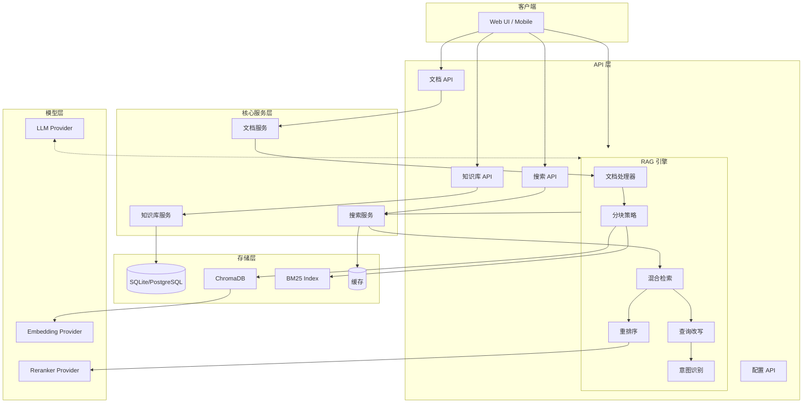
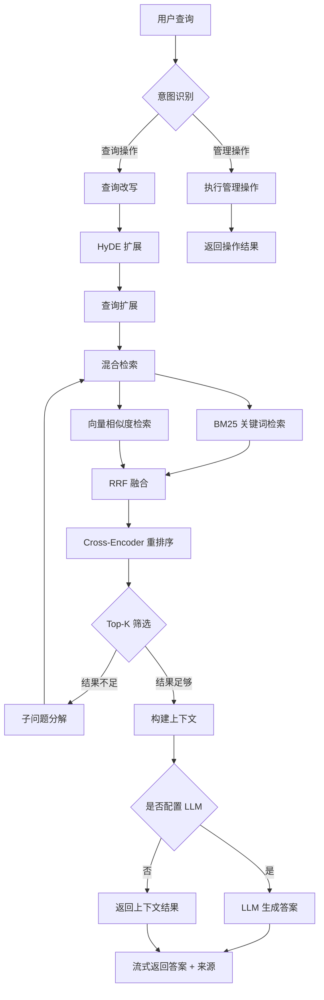

# RagDocMan

[](https://www.python.org/)
[](https://fastapi.tiangolo.com/)
[](LICENSE)
[](https://github.com/RagDocMan)

RagDocMan 是一个基于高级 RAG（检索增强生成）技术的智能知识库管理系统。它允许用户通过自然语言对话来管理文档库，实现"所说即所得"的操作体验。


## 特性

- **自然语言交互** - 通过对话即可完成知识库创建、文档上传、智能检索等操作
- **高级 RAG 技术栈** - 混合检索、重排序、查询改写等多阶段检索增强
- **多模型支持** - 支持 OpenAI、Anthropic、DeepSeek、硅基流动等多个 LLM 服务商
- **隐私保护** - 支持本地模型部署，数据完全可控
- **流式响应** - 支持 SSE 流式输出，提升用户体验

## 技术栈

### 核心框架

| 类别 | 技术 |
|------|------|
| Web 框架 | FastAPI |
| ORM | SQLAlchemy |
| 数据库 | SQLite / PostgreSQL |
| 向量数据库 | ChromaDB |
| 向量检索 | FAISS |
| 关键词检索 | rank-bm25 |
| 重排序 | sentence-transformers (CrossEncoder) |
| 文档解析 | python-docx, pypdf, markdown, unstructured |
| LLM 框架 | LangChain |

### 测试与工具

- **测试框架**: pytest, pytest-asyncio, pytest-cov
- **日志**: Python logging with rotation
- **中间件**: CORS, Error Handling, Request Logging

---

## 系统架构



---

## RAG 工作流程



---

## 项目结构

```
RagDocMan/
├── api/                          # FastAPI 路由
│   ├── knowledge_base_routes.py  # 知识库 CRUD
│   ├── document_routes.py        # 文档管理
│   ├── search_routes.py          # 搜索接口
│   ├── rag_routes.py             # RAG 生成
│   └── config_routes.py          # 配置管理
├── core/                         # 核心模块
│   ├── llm_provider.py           # LLM 集成
│   ├── embedding_provider.py     # 嵌入模型
│   ├── reranker_provider.py      # 重排序模型
│   ├── vector_store.py           # ChromaDB 集成
│   ├── batch_processor.py        # 批处理
│   ├── cache.py                  # 缓存机制
│   └── faiss_optimizer.py        # FAISS 优化
├── models/                       # 数据模型
│   ├── orm.py                    # SQLAlchemy 模型
│   └── schemas.py                # Pydantic 模型
├── rag/                          # RAG 核心
│   ├── document_processor.py     # 文档解析
│   ├── chunking_strategy.py      # 文本分块
│   ├── retriever.py              # 混合检索
│   ├── reranker.py               # 结果重排序
│   ├── query_rewriter.py         # 查询改写
│   └── intent_recognizer.py      # 意图识别
├── services/                     # 业务逻辑
│   ├── knowledge_base_service.py
│   ├── document_service.py
│   └── search_service.py
├── tests/                        # 测试
├── main.py                       # 应用入口
├── config.py                     # 配置管理
├── database.py                   # 数据库配置
├── logger.py                     # 日志配置
├── middleware.py                 # 中间件
└── requirements.txt              # 依赖
```

---

## 快速开始

### 环境要求

- Python 3.10+
- Node.js 18+ (前端开发)
- 8GB+ RAM（本地模型需要更多）

### 安装

```bash
# 1. 克隆仓库
git clone https://github.com/yourusername/RagDocMan.git
cd RagDocMan

# 2. 创建虚拟环境
python -m venv venv
source venv/bin/activate  # Linux/Mac
# venv\Scripts\activate  # Windows

# 3. 安装依赖
pip install -r requirements.txt

# 4. 复制环境配置
cp .env.example .env

# 5. 编辑 .env 填入 API Key（详见配置章节）
```

### 运行

```bash
# 启动服务器
python main.py

# 或使用 uvicorn
uvicorn main:app --host 0.0.0.0 --port 8000 --reload
```

服务启动后访问：

- Swagger API 文档: <http://localhost:8000/docs>
- ReDoc: <http://localhost:8000/redoc>

---

## API 端点

### 知识库管理

- `POST /api/knowledge-bases` - 创建知识库
- `GET /api/knowledge-bases` - 列出所有知识库
- `GET /api/knowledge-bases/{kb_id}` - 获取知识库详情
- `PUT /api/knowledge-bases/{kb_id}` - 更新知识库
- `DELETE /api/knowledge-bases/{kb_id}` - 删除知识库

### 文档管理

- `POST /api/knowledge-bases/{kb_id}/documents` - 上传文档
- `GET /api/knowledge-bases/{kb_id}/documents` - 列出文档
- `DELETE /api/knowledge-bases/{kb_id}/documents/{doc_id}` - 删除文档

### 搜索

- `POST /api/search` - 基础混合搜索
- `POST /api/search/with-rewrite` - 带查询改写的搜索

### RAG

- `POST /rag/answer` - 生成答案（非流式）
- `POST /rag/answer/stream` - 流式生成答案（SSE）

### 配置

- `GET /api/config` - 获取当前配置
- `PUT /api/config` - 更新配置

---

## API 响应格式

所有 API 接口使用统一的响应格式：

### 成功响应

```json
{
  "success": true,
  "data": { ... },
  "message": null
}
```

### 错误响应

```json
{
  "success": false,
  "data": null,
  "error": {
    "code": "INVALID_REQUEST",
    "message": "详细错误描述"
  }
}
```

### 分页响应

```json
{
  "success": true,
  "data": [...],
  "meta": {
    "total": 100,
    "page": 1,
    "limit": 20,
    "pages": 5
  }
}
```

---

## 配置

配置通过 `.env` 文件管理：

```bash
# 应用程序
APP_NAME=RagDocMan
APP_VERSION=1.0.0
DEBUG=false
LOG_LEVEL=INFO

# 数据库
DATABASE_URL=sqlite:///./ragdocman.db

# 向量存储
CHROMA_DB_PATH=./chroma_data

# LLM 配置
LLM_PROVIDER=siliconflow
LLM_API_KEY=your_api_key
LLM_MODEL=Qwen/Qwen2-7B-Instruct

# 嵌入配置
EMBEDDING_PROVIDER=siliconflow
EMBEDDING_API_KEY=your_api_key
EMBEDDING_MODEL=BAAI/bge-m3

# 重排序配置
RERANKER_PROVIDER=siliconflow
RERANKER_API_KEY=your_api_key
RERANKER_MODEL=BAAI/bge-reranker-base

# 处理参数
CHUNK_SIZE=1024
CHUNK_OVERLAP=128
RETRIEVAL_TOP_K=10
RERANKING_TOP_K=5
MAX_FILE_SIZE_MB=100
```

### 模型推荐

#### LLM 模型

| 服务商 | 模型 | 特点 |
| :--- | :--- | :--- |
| **硅基流动** | Qwen2.5、Llama3、Gemma2 | 主推，国内访问快 |
| Anthropic | Claude-3-Opus/Sonnet/Haiku | 长上下文 |
| DeepSeek | deepseek-chat/coder | 国产性价比高 |
| OpenAI | GPT-4, GPT-4-Turbo | API 稳定 |

#### 嵌入模型

| 服务商 | 推荐模型 | 维度 |
| :--- | :--- | :--- |
| **硅基流动** | BAAI/bge-m3 | 1024 |
| **硅基流动** | BAAI/bge-large-zh-v1.5 | 1024 |
| Jina AI | jina-embeddings-v2-base-zh | 768 |

强烈建议硅基流动！➡️ [硅基流动](https://cloud.siliconflow.cn/i/dbb2IJTv)

`注册立马送16元！！！所有高端模型可用！！！`
---

## 一句话操作示例

### 知识库管理

```plaintext
"创建一个叫'产品文档'的知识库" → 自动创建独立向量空间 ✅
"把技术文档库合并到产品库" → 智能去重合并 ❌
"删除 3 个月没用的测试库" → 自动识别并清理 ❌ -- 还未实现
```

### 文档操作

```plaintext
"把这 10 份 PDF 加到法务库" → 批量上传 + 自动分类 -- 目前要手动上传
"更新合同模板到最新版本" → 版本检测 + 增量更新 
"删掉所有过期的内部文档" → 时间范围智能筛选删除
```

### 智能检索

```plaintext
"上周开会提到的那个客户方案在哪？" → 时间 + 语义联合定位
"对比一下新旧两版的技术差异" → 多文档对比分析
"找出所有涉及合规风险的段落" → 跨库主题检索
```

---

## 开发规范

### 代码风格

- **Python**: PEP 8 + Black 格式化 + mypy 类型检查
- **TypeScript**: 严格模式 + ESLint + Prettier

### 提交规范

遵循 Conventional Commits：

- `feat`: 新功能
- `fix`: Bug 修复
- `refactor`: 代码重构
- `docs`: 文档更新
- `test`: 测试相关
- `chore`: 构建/工具配置

### 测试覆盖率

- 最低要求：80%
- 测试类型：单元测试、集成测试、E2E 测试

---

## 许可证

MIT License

---

## 贡献

欢迎提交 Issue 和 Pull Request！

---

## 状态

🚧 开发中
v-0.1.2 -- 26/2/18

### 作者
Chasen