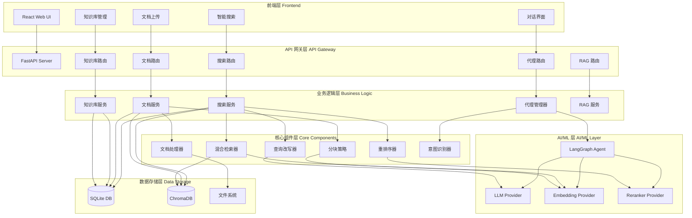
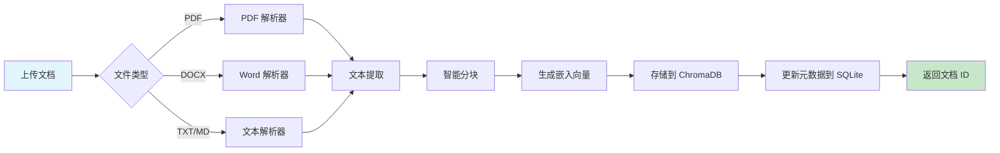
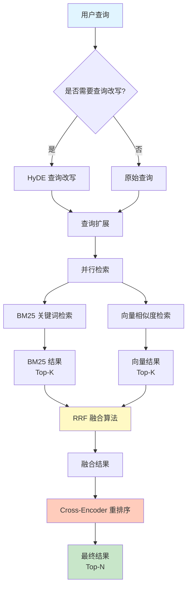
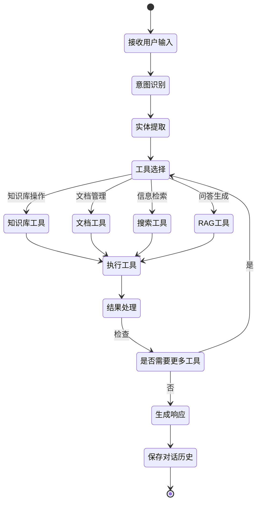

# RagDocMan - 智能知识库管理与 RAG 增强系统

<div align="center">


一个基于高级 RAG（检索增强生成）技术的智能知识库管理系统，支持多模态文档处理、混合检索、智能对话代理等功能。

[功能特性](#功能特性) • [技术架构](#技术架构) • [快速开始](#快速开始) • [API 文档](#api-文档) • [开发指南](#开发指南)

</div>

---

## 📋 目录

- [功能特性](#功能特性)
- [技术架构](#技术架构)
- [系统架构图](#系统架构图)
- [核心技术要点](#核心技术要点)
- [快速开始](#快速开始)
- [配置说明](#配置说明)
- [API 文档](#api-文档)
- [项目结构](#项目结构)
- [开发指南](#开发指南)
- [性能优化](#性能优化)
- [常见问题](#常见问题)

---

## ✨ 功能特性

### 🗂️ 知识库管理
- **多知识库支持**: 创建、更新、删除多个独立的知识库
- **知识库隔离**: 每个知识库拥有独立的向量存储和文档管理
- **元数据管理**: 支持自定义知识库描述和配置

### 📄 文档处理
- **多格式支持**: PDF、Word (DOCX)、TXT、Markdown 等格式
- **智能分块**: 基于语义的文档分块策略，保持上下文完整性
- **批量上传**: 支持批量文档上传和处理
- **文档更新**: 支持文档内容更新和重新索引

### 🔍 高级检索
- **混合检索**: 结合 BM25 关键词检索和向量相似度检索
- **查询改写**: 使用 HyDE (Hypothetical Document Embeddings) 优化查询
- **查询扩展**: 自动扩展查询以覆盖相关概念
- **结果重排序**: 使用 Cross-Encoder 模型精准排序检索结果
- **RRF 融合**: Reciprocal Rank Fusion 算法融合多路检索结果

### 🤖 智能对话代理
- **工具调用**: 基于 LangGraph 的智能工具调用和编排
- **意图识别**: 自动识别用户意图并提取相关实体
- **上下文记忆**: 持久化对话历史，支持多轮对话
- **流式响应**: 支持 SSE (Server-Sent Events) 流式输出
- **会话管理**: 多会话隔离和历史记录管理

### 🎯 RAG 生成
- **上下文增强**: 基于检索结果生成准确答案
- **引用溯源**: 提供答案来源和相关文档引用
- **多模型支持**: 支持 OpenAI、Anthropic、SiliconFlow 等多种 LLM

---

## 🏗️ 技术架构

### 技术栈

#### 后端技术
- **Web 框架**: FastAPI 0.109.0
- **数据库**: SQLAlchemy 2.0.25 + SQLite
- **向量数据库**: ChromaDB 0.4.24
- **LLM 框架**: LangChain 1.0+, LangGraph
- **文档处理**: PyPDF, python-docx
- **检索算法**: BM25, Sentence Transformers
- **异步支持**: asyncio, aiohttp

#### 前端技术
- **框架**: React 18.2.0
- **构建工具**: Vite 5.0.0
- **路由**: React Router DOM 6.20.0
- **Markdown 渲染**: react-markdown 10.1.0

#### AI/ML 组件
- **嵌入模型**: Sentence Transformers, BAAI/bge-small-zh-v1.5
- **重排序模型**: Cross-Encoder
- **LLM**: OpenAI GPT, Anthropic Claude, Qwen 系列

---

## 📊 系统架构图

### 整体架构


```mermaid
graph TB
    subgraph "前端层 Frontend"
        A[React Web UI]
        A1[知识库管理]
        A2[文档上传]
        A3[智能搜索]
        A4[对话界面]
    end

    subgraph "API 网关层 API Gateway"
        B[FastAPI Server]
        B1[知识库路由]
        B2[文档路由]
        B3[搜索路由]
        B4[代理路由]
        B5[RAG 路由]
    end

    subgraph "业务逻辑层 Business Logic"
        C1[知识库服务]
        C2[文档服务]
        C3[搜索服务]
        C4[代理管理器]
        C5[RAG 服务]
    end

    subgraph "核心组件层 Core Components"
        D1[文档处理器]
        D2[分块策略]
        D3[混合检索器]
        D4[查询改写器]
        D5[重排序器]
        D6[意图识别器]
    end

    subgraph "AI/ML 层 AI/ML Layer"
        E1[LLM Provider]
        E2[Embedding Provider]
        E3[Reranker Provider]
        E4[LangGraph Agent]
    end

    subgraph "数据存储层 Data Storage"
        F1[(SQLite DB)]
        F2[(ChromaDB)]
        F3[文件系统]
    end

    A --> B
    A1 --> B1
    A2 --> B2
    A3 --> B3
    A4 --> B4

    B1 --> C1
    B2 --> C2
    B3 --> C3
    B4 --> C4
    B5 --> C5

    C1 --> F1
    C2 --> D1
    C2 --> D2
    C3 --> D3
    C3 --> D4
    C3 --> D5
    C4 --> D6
    C4 --> E4

    D1 --> F3
    D2 --> E2
    D3 --> E2
    D3 --> F2
    D4 --> E1
    D5 --> E3

    E4 --> E1
    E4 --> E2
    E4 --> E3

    C1 --> F1
    C2 --> F1
    C2 --> F2
    C3 --> F1
    C3 --> F2
```

### 文档处理流程


```mermaid
flowchart LR
    A[上传文档] --> B{文件类型}
    B -->|PDF| C[PDF 解析器]
    B -->|DOCX| D[Word 解析器]
    B -->|TXT/MD| E[文本解析器]
    
    C --> F[文本提取]
    D --> F
    E --> F
    
    F --> G[智能分块]
    G --> H[生成嵌入向量]
    H --> I[存储到 ChromaDB]
    I --> J[更新元数据到 SQLite]
    J --> K[返回文档 ID]
    
    style A fill:#e1f5ff
    style K fill:#c8e6c9
```

### 混合检索流程


```mermaid
flowchart TB
    A[用户查询] --> B{是否需要查询改写?}
    
    B -->|是| C[HyDE 查询改写]
    B -->|否| D[原始查询]
    C --> E[查询扩展]
    D --> E
    
    E --> F[并行检索]
    
    F --> G[BM25 关键词检索]
    F --> H[向量相似度检索]
    
    G --> I[BM25 结果<br/>Top-K]
    H --> J[向量结果<br/>Top-K]
    
    I --> K[RRF 融合算法]
    J --> K
    
    K --> L[融合结果]
    L --> M[Cross-Encoder 重排序]
    M --> N[最终结果<br/>Top-N]
    
    style A fill:#e1f5ff
    style N fill:#c8e6c9
    style K fill:#fff9c4
    style M fill:#ffccbc
```

### 智能代理工作流


```mermaid
stateDiagram-v2
    [*] --> 接收用户输入
    
    接收用户输入 --> 意图识别
    意图识别 --> 实体提取
    
    实体提取 --> 工具选择
    
    工具选择 --> 知识库工具: 知识库操作
    工具选择 --> 文档工具: 文档管理
    工具选择 --> 搜索工具: 信息检索
    工具选择 --> RAG工具: 问答生成
    
    知识库工具 --> 执行工具
    文档工具 --> 执行工具
    搜索工具 --> 执行工具
    RAG工具 --> 执行工具
    
    执行工具 --> 结果处理
    结果处理 --> 是否需要更多工具: 检查
    
    是否需要更多工具 --> 工具选择: 是
    是否需要更多工具 --> 生成响应: 否
    
    生成响应 --> 保存对话历史
    保存对话历史 --> [*]
```


---

## 🔑 核心技术要点

### 1. 混合检索策略

结合稀疏检索（BM25）和密集检索（向量相似度）的优势：

- **BM25**: 精确匹配关键词，适合专有名词和精确查询
- **向量检索**: 语义相似度匹配，适合模糊查询和概念检索
- **RRF 融合**: 使用 Reciprocal Rank Fusion 算法平衡两种检索结果

```python
# RRF 融合公式
score(d) = Σ(1 / (k + rank_i(d)))
# k: 常数 (通常为 60)
# rank_i(d): 文档 d 在第 i 个检索器中的排名
```

### 2. 查询优化技术

#### HyDE (Hypothetical Document Embeddings)
- 使用 LLM 生成假设性文档
- 将查询转换为更接近目标文档的形式
- 提高检索准确率

#### 查询扩展
- 自动添加同义词和相关概念
- 扩大检索覆盖范围
- 减少查询歧义

### 3. 智能分块策略

- **语义分块**: 保持段落和句子的完整性
- **重叠分块**: 避免关键信息在边界处丢失
- **元数据保留**: 保留文档来源、页码等信息

```python
chunk_size = 1024      # 每个块的字符数
chunk_overlap = 128    # 块之间的重叠字符数
```

### 4. Cross-Encoder 重排序

使用 Cross-Encoder 模型对检索结果进行精准排序：

- 输入: (query, document) 对
- 输出: 相关性分数
- 优势: 比向量相似度更准确，但计算成本更高

### 5. LangGraph 代理架构

基于 LangGraph 构建的智能代理系统：

- **状态管理**: 维护对话状态和工具调用历史
- **工具编排**: 自动选择和组合多个工具
- **错误处理**: 自动重试和降级策略
- **流式输出**: 支持实时响应流式传输

### 6. 持久化对话记忆

- **数据库存储**: 对话历史存储在 SQLite
- **会话隔离**: 每个会话独立管理
- **自动摘要**: 长对话自动摘要压缩
- **上下文窗口**: 智能管理上下文长度

---

## 🚀 快速开始

### 环境要求

- Python 3.8+
- Node.js 16+
- SQLite 3
- 8GB+ RAM (推荐)

### 安装步骤

#### 1. 克隆项目

```bash
git clone https://github.com/yourusername/RagDocMan.git
cd RagDocMan
```

#### 2. 后端设置

```bash
cd RagDocMan

# 创建虚拟环境
python -m venv venv

# 激活虚拟环境
# Windows
venv\Scripts\activate
# Linux/Mac
source venv/bin/activate

# 安装依赖
pip install -r requirements.txt

# 配置环境变量
cp .env.example .env
# 编辑 .env 文件，填入你的 API Keys
```

#### 3. 前端设置

```bash
cd frontend

# 安装依赖
npm install

# 配置环境变量
cp .env.example .env
```

#### 4. 启动服务

```bash
# 启动后端 (在 RagDocMan 目录)
python run.py
# 或
uvicorn main:app --host 0.0.0.0 --port 8000 --reload

# 启动前端 (在 frontend 目录)
npm run dev
```

#### 5. 访问应用

- 前端界面: http://localhost:5173
- API 文档: http://localhost:8000/docs
- ReDoc 文档: http://localhost:8000/redoc

---

## ⚙️ 配置说明

### 环境变量配置

在 `RagDocMan/.env` 文件中配置以下参数：

```bash
# 数据库配置
DATABASE_URL=sqlite:///./ragdocman.db

# LLM 配置
LLM_PROVIDER=siliconflow
LLM_API_KEY=your_api_key_here
LLM_MODEL=Qwen/Qwen2-7B-Instruct

# 嵌入模型配置
EMBEDDING_PROVIDER=siliconflow
EMBEDDING_MODEL=BAAI/bge-small-zh-v1.5
EMBEDDING_API_KEY=your_embedding_api_key

# 重排序模型配置
RERANKER_PROVIDER=siliconflow
RERANKER_MODEL=BAAI/bge-reranker-base
RERANKER_API_KEY=your_reranker_api_key

# 向量存储配置
VECTOR_STORE_PATH=./chroma_data

# 应用配置
APP_NAME=RagDocMan
APP_VERSION=0.2.1
DEBUG=False
LOG_LEVEL=INFO

# 服务器配置
HOST=0.0.0.0
PORT=8000

# 文件处理配置
MAX_FILE_SIZE_MB=100
CHUNK_SIZE=1024
CHUNK_OVERLAP=128

# 检索配置
RETRIEVAL_TOP_K=10
RERANKING_TOP_K=5
EMBEDDING_BATCH_SIZE=2
```

### 支持的 LLM 提供商

- **OpenAI**: GPT-3.5, GPT-4 系列
- **Anthropic**: Claude 系列
- **SiliconFlow**: Qwen, ChatGLM 等国产模型
- **自定义**: 支持 OpenAI 兼容的 API

---

## 📚 API 文档

### 统一响应格式

所有 API 接口使用统一的响应格式：

#### 成功响应
```json
{
  "success": true,
  "data": { ... },
  "message": null
}
```

#### 错误响应
```json
{
  "success": false,
  "data": null,
  "error": {
    "code": "ERROR_CODE",
    "message": "错误描述"
  }
}
```

#### 分页响应
```json
{
  "success": true,
  "data": [...],
  "meta": {
    "total": 100,
    "page": 1,
    "limit": 20,
    "pages": 5
  }
}
```

### 主要 API 端点

#### 知识库管理

```bash
# 创建知识库
POST /knowledge-bases
{
  "name": "技术文档库",
  "description": "存储技术文档和API文档"
}

# 获取知识库列表
GET /knowledge-bases?page=1&limit=20

# 获取知识库详情
GET /knowledge-bases/{kb_id}

# 更新知识库
PUT /knowledge-bases/{kb_id}

# 删除知识库
DELETE /knowledge-bases/{kb_id}
```

#### 文档管理

```bash
# 上传文档
POST /documents/upload
Content-Type: multipart/form-data
- file: 文档文件
- kb_id: 知识库ID

# 获取文档列表
GET /documents?kb_id={kb_id}&page=1&limit=20

# 获取文档详情
GET /documents/{doc_id}

# 更新文档
PUT /documents/{doc_id}

# 删除文档
DELETE /documents/{doc_id}
```

#### 搜索

```bash
# 基础混合搜索
POST /search
{
  "kb_id": "kb_123456",
  "query": "如何配置环境变量？",
  "top_k": 5
}

# 带查询改写的搜索
POST /search/with-rewrite
{
  "kb_id": "kb_123456",
  "query": "上周会议提到的那个方案",
  "top_k": 5
}
```

#### RAG 生成

```bash
# RAG 问答
POST /rag/generate
{
  "kb_id": "kb_123456",
  "query": "系统的主要功能有哪些？",
  "top_k": 5
}
```

#### 智能代理

```bash
# 对话 (同步)
POST /api/v1/agent/chat
{
  "user_input": "帮我创建一个名为'产品文档'的知识库",
  "session_id": "session_001",
  "stream": false
}

# 对话 (流式)
POST /api/v1/agent/chat/stream
{
  "user_input": "搜索关于API认证的文档",
  "session_id": "session_001",
  "kb_id": "kb_123456"
}

# 获取会话列表
GET /api/v1/agent/sessions

# 获取会话历史
GET /api/v1/agent/sessions/{session_id}/history

# 清除会话
DELETE /api/v1/agent/session/{session_id}
```

---

## 📁 项目结构

```
RagDocMan/
├── RagDocMan/                 # 后端主目录
│   ├── api/                   # API 路由
│   │   ├── knowledge_base_routes.py
│   │   ├── document_routes.py
│   │   ├── search_routes.py
│   │   ├── agent_routes.py
│   │   └── rag_routes.py
│   ├── core/                  # 核心组件
│   │   ├── llm_provider.py
│   │   ├── embedding_provider.py
│   │   ├── reranker_provider.py
│   │   └── vector_store.py
│   ├── models/                # 数据模型
│   │   ├── orm.py            # ORM 模型
│   │   └── schemas.py        # Pydantic 模型
│   ├── rag/                   # RAG 核心模块
│   │   ├── agent_manager_core.py
│   │   ├── document_processor.py
│   │   ├── chunking_strategy.py
│   │   ├── retriever.py
│   │   ├── reranker.py
│   │   ├── query_rewriter.py
│   │   └── intent_recognizer.py
│   ├── services/              # 业务服务
│   │   ├── knowledge_base_service.py
│   │   ├── document_service.py
│   │   └── search_service.py
│   ├── tools/                 # Agent 工具
│   ├── tests/                 # 测试文件
│   ├── main.py               # 应用入口
│   ├── config.py             # 配置管理
│   ├── database.py           # 数据库连接
│   └── requirements.txt      # Python 依赖
│
├── frontend/                  # 前端主目录
│   ├── src/
│   │   ├── components/       # React 组件
│   │   ├── services/         # API 服务
│   │   ├── pages/            # 页面组件
│   │   └── App.jsx           # 应用入口
│   ├── package.json
│   └── vite.config.js
│
├── chroma_data/              # ChromaDB 数据
├── logs/                     # 日志文件
├── uploads/                  # 上传文件
└── README.md                 # 项目文档
```

---

## 🛠️ 开发指南

### 添加新的文档类型支持

1. 在 `rag/document_processor.py` 中添加新的解析器
2. 更新 `config.py` 中的 `supported_file_types`
3. 添加相应的测试用例

### 添加新的 LLM 提供商

1. 在 `core/llm_provider.py` 中实现新的 Provider 类
2. 继承 `LLMProvider` 基类
3. 实现 `generate()` 和 `agenerate()` 方法
4. 在 `LLMProviderFactory` 中注册

### 添加新的 Agent 工具

1. 在 `tools/` 目录创建新的工具类
2. 继承 `BaseTool` 并实现 `_run()` 方法
3. 在 `agent_routes.py` 中注册工具

### 运行测试

```bash
# 运行所有测试
pytest

# 运行特定测试文件
pytest tests/test_search_service.py

# 运行带覆盖率的测试
pytest --cov=RagDocMan tests/
```

---

## ⚡ 性能优化

### 1. 批量嵌入

```python
# 配置批量大小以平衡速度和内存
EMBEDDING_BATCH_SIZE=2  # 减少以避免 API 限制
```

### 2. 缓存策略

- 查询结果缓存
- 嵌入向量缓存
- LLM 响应缓存

### 3. 异步处理

- 文档上传异步处理
- 批量文档并行处理
- 异步 API 调用

### 4. 数据库优化

- 添加适当的索引
- 使用连接池
- 定期清理过期数据

---

## ❓ 常见问题

### Q1: 如何选择合适的 chunk_size?

**A**: 取决于你的文档类型和查询模式：
- 技术文档: 512-1024 字符
- 长篇文章: 1024-2048 字符
- 对话记录: 256-512 字符

### Q2: 为什么搜索结果不准确?

**A**: 可能的原因：
1. 嵌入模型不适合你的领域 → 尝试其他模型
2. chunk_size 设置不当 → 调整分块大小
3. top_k 设置过小 → 增加检索数量
4. 需要使用查询改写 → 使用 `/search/with-rewrite`

### Q3: 如何提高 RAG 生成质量?

**A**: 优化建议：
1. 使用更强大的 LLM 模型
2. 增加检索的 top_k 值
3. 启用查询改写和重排序
4. 优化提示词模板
5. 提供更多上下文信息

### Q4: 支持哪些语言?

**A**: 
- 中文: 完全支持，推荐使用 `bge-small-zh-v1.5`
- 英文: 完全支持
- 其他语言: 需要选择对应的嵌入模型

### Q5: 如何处理大文件?

**A**: 
1. 调整 `MAX_FILE_SIZE_MB` 配置
2. 使用异步上传
3. 考虑文件分割
4. 增加服务器内存

---

## 📄 许可证

本项目采用 MIT 许可证。详见 [LICENSE](LICENSE) 文件。

---

## 🤝 贡献

欢迎贡献代码、报告问题或提出新功能建议！

1. Fork 本项目
2. 创建特性分支 (`git checkout -b feature/AmazingFeature`)
3. 提交更改 (`git commit -m 'Add some AmazingFeature'`)
4. 推送到分支 (`git push origin feature/AmazingFeature`)
5. 开启 Pull Request

---

## 📞 联系方式

- 项目主页: [GitHub Repository]
- 问题反馈: [GitHub Issues]
- 文档: [Documentation]

---

## 🙏 致谢

感谢以下开源项目：

- [FastAPI](https://fastapi.tiangolo.com/)
- [LangChain](https://www.langchain.com/)
- [ChromaDB](https://www.trychroma.com/)
- [React](https://react.dev/)
- [Sentence Transformers](https://www.sbert.net/)

---

<div align="center">

**⭐ 如果这个项目对你有帮助，请给它一个 Star！⭐**

Made with ❤️ by Chasen

</div>
```
