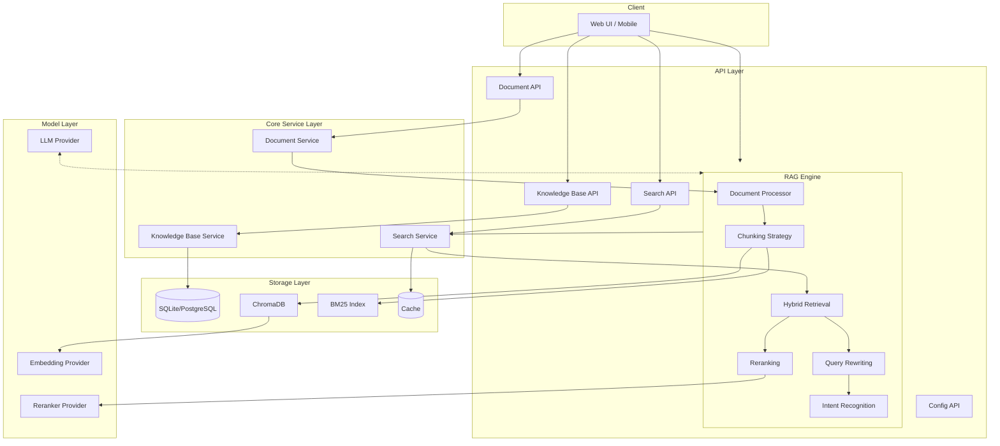
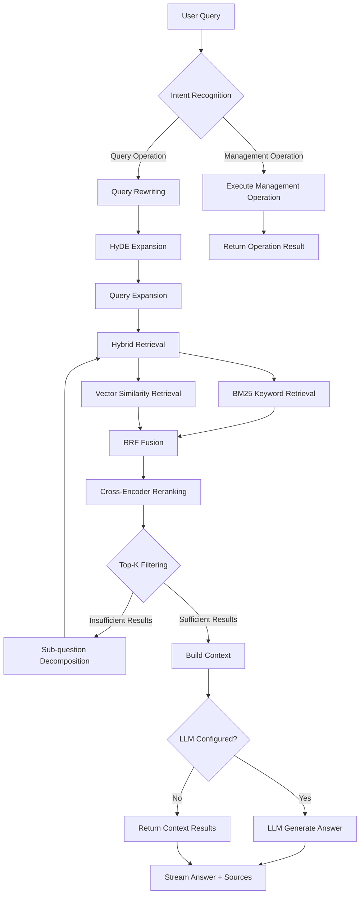

# RagDocMan

[](https://www.python.org/)
[](https://fastapi.tiangolo.com/)
[](LICENSE)
[](https://github.com/RagDocMan)

**Language:** [中文](README.md) | English

---

RagDocMan is an intelligent knowledge base management system based on advanced RAG (Retrieval-Augmented Generation) technology. It allows users to manage document libraries through natural language conversations, achieving a "what you say is what you get" operational experience.


## Features

- **Natural Language Interaction** - Complete knowledge base creation, document upload, intelligent retrieval and other operations through conversation
- **Advanced RAG Technology Stack** - Multi-stage retrieval enhancement including hybrid retrieval, reranking, and query rewriting
- **Multi-Model Support** - Support for multiple LLM providers including OpenAI, Anthropic, DeepSeek, and SiliconFlow
- **Privacy Protection** - Support for local model deployment with complete data control
- **Streaming Response** - Support for SSE streaming output to enhance user experience

## Technology Stack

### Core Framework

| Category | Technology |
|----------|-----------|
| Web Framework | FastAPI |
| ORM | SQLAlchemy |
| Database | SQLite / PostgreSQL |
| Vector Database | ChromaDB |
| Vector Retrieval | FAISS |
| Keyword Retrieval | rank-bm25 |
| Reranking | sentence-transformers (CrossEncoder) |
| Document Parsing | python-docx, pypdf, markdown, unstructured |
| LLM Framework | LangChain |

### Testing & Tools

- **Testing Framework**: pytest, pytest-asyncio, pytest-cov
- **Logging**: Python logging with rotation
- **Middleware**: CORS, Error Handling, Request Logging

---

## System Architecture



---

## RAG Workflow



---

## Project Structure

```
RagDocMan/
├── api/                          # FastAPI Routes
│   ├── knowledge_base_routes.py  # Knowledge Base CRUD
│   ├── document_routes.py        # Document Management
│   ├── search_routes.py          # Search Interface
│   ├── rag_routes.py             # RAG Generation
│   └── config_routes.py          # Configuration Management
├── core/                         # Core Modules
│   ├── llm_provider.py           # LLM Integration
│   ├── embedding_provider.py     # Embedding Model
│   ├── reranker_provider.py      # Reranker Model
│   ├── vector_store.py           # ChromaDB Integration
│   ├── batch_processor.py        # Batch Processing
│   ├── cache.py                  # Caching Mechanism
│   └── faiss_optimizer.py        # FAISS Optimization
├── models/                       # Data Models
│   ├── orm.py                    # SQLAlchemy Models
│   └── schemas.py                # Pydantic Models
├── rag/                          # RAG Core
│   ├── document_processor.py     # Document Parsing
│   ├── chunking_strategy.py      # Text Chunking
│   ├── retriever.py              # Hybrid Retrieval
│   ├── reranker.py               # Result Reranking
│   ├── query_rewriter.py         # Query Rewriting
│   └── intent_recognizer.py      # Intent Recognition
├── services/                     # Business Logic
│   ├── knowledge_base_service.py
│   ├── document_service.py
│   └── search_service.py
├── tests/                        # Tests
├── main.py                       # Application Entry
├── config.py                     # Configuration Management
├── database.py                   # Database Configuration
├── logger.py                     # Logging Configuration
├── middleware.py                 # Middleware
└── requirements.txt              # Dependencies
```

---

## Quick Start

### Requirements

- Python 3.10+
- Node.js 18+ (for frontend development)
- 8GB+ RAM (more required for local models)

### Installation

```bash
# 1. Clone the repository
git clone https://github.com/yourusername/RagDocMan.git
cd RagDocMan

# 2. Create virtual environment
python -m venv venv
source venv/bin/activate  # Linux/Mac
# venv\Scripts\activate  # Windows

# 3. Install dependencies
pip install -r requirements.txt

# 4. Copy environment configuration
cp .env.example .env

# 5. Edit .env and add API Keys (see Configuration section)
```

### Running

```bash
# Start the server
python main.py

# Or use uvicorn
uvicorn main:app --host 0.0.0.0 --port 8000 --reload
```

After startup, visit:

- Swagger API Documentation: <http://localhost:8000/docs>
- ReDoc: <http://localhost:8000/redoc>

---

## API Endpoints

### Knowledge Base Management

- `POST /api/knowledge-bases` - Create knowledge base
- `GET /api/knowledge-bases` - List all knowledge bases
- `GET /api/knowledge-bases/{kb_id}` - Get knowledge base details
- `PUT /api/knowledge-bases/{kb_id}` - Update knowledge base
- `DELETE /api/knowledge-bases/{kb_id}` - Delete knowledge base

### Document Management

- `POST /api/knowledge-bases/{kb_id}/documents` - Upload document
- `GET /api/knowledge-bases/{kb_id}/documents` - List documents
- `DELETE /api/knowledge-bases/{kb_id}/documents/{doc_id}` - Delete document

### Search

- `POST /api/search` - Basic hybrid search
- `POST /api/search/with-rewrite` - Search with query rewriting

### RAG

- `POST /rag/answer` - Generate answer (non-streaming)
- `POST /rag/answer/stream` - Stream answer generation (SSE)

### Configuration

- `GET /api/config` - Get current configuration
- `PUT /api/config` - Update configuration

---

## API Response Format

All API endpoints use a unified response format:

### Success Response

```json
{
  "success": true,
  "data": { ... },
  "message": null
}
```

### Error Response

```json
{
  "success": false,
  "data": null,
  "error": {
    "code": "INVALID_REQUEST",
    "message": "Detailed error description"
  }
}
```

### Pagination Response

```json
{
  "success": true,
  "data": [...],
  "meta": {
    "total": 100,
    "page": 1,
    "limit": 20,
    "pages": 5
  }
}
```

---

## Configuration

Configuration is managed through the `.env` file:

```bash
# Application
APP_NAME=RagDocMan
APP_VERSION=1.0.0
DEBUG=false
LOG_LEVEL=INFO

# Database
DATABASE_URL=sqlite:///./ragdocman.db

# Vector Store
CHROMA_DB_PATH=./chroma_data

# LLM Configuration
LLM_PROVIDER=siliconflow
LLM_API_KEY=your_api_key
LLM_MODEL=Qwen/Qwen2-7B-Instruct

# Embedding Configuration
EMBEDDING_PROVIDER=siliconflow
EMBEDDING_API_KEY=your_api_key
EMBEDDING_MODEL=BAAI/bge-m3

# Reranker Configuration
RERANKER_PROVIDER=siliconflow
RERANKER_API_KEY=your_api_key
RERANKER_MODEL=BAAI/bge-reranker-base

# Processing Parameters
CHUNK_SIZE=1024
CHUNK_OVERLAP=128
RETRIEVAL_TOP_K=10
RERANKING_TOP_K=5
MAX_FILE_SIZE_MB=100
```

### Recommended Models

#### LLM Models

| Provider | Model | Features |
| :--- | :--- | :--- |
| **SiliconFlow** | Qwen2.5, Llama3, Gemma2 | Recommended, fast access in China |
| Anthropic | Claude-3-Opus/Sonnet/Haiku | Long context |
| DeepSeek | deepseek-chat/coder | Cost-effective |
| OpenAI | GPT-4, GPT-4-Turbo | Stable API |

#### Embedding Models

| Provider | Recommended Model | Dimension |
| :--- | :--- | :--- |
| **SiliconFlow** | BAAI/bge-m3 | 1024 |
| **SiliconFlow** | BAAI/bge-large-zh-v1.5 | 1024 |
| Jina AI | jina-embeddings-v2-base-zh | 768 |

Highly recommend SiliconFlow! ➡️ [SiliconFlow](https://cloud.siliconflow.cn/i/dbb2IJTv)

`Register now and get 16 yuan credit! All premium models available!`

---

## One-Sentence Operation Examples

### Knowledge Base Management

```plaintext
"Create a knowledge base called 'Product Documentation'" → Auto create independent vector space ✅
"Merge technical documentation library to product library" → Intelligent deduplication merge ❌
"Delete unused test libraries from 3 months ago" → Auto identify and clean up ❌ -- Not yet implemented
```

### Document Operations

```plaintext
"Add these 10 PDFs to the legal library" → Batch upload + auto categorization -- Currently manual upload
"Update contract template to latest version" → Version detection + incremental update
"Delete all expired internal documents" → Time range intelligent filtering and deletion
```

### Intelligent Retrieval

```plaintext
"Where is that customer proposal mentioned in last week's meeting?" → Time + semantic joint positioning
"Compare the technical differences between old and new versions" → Multi-document comparison analysis
"Find all paragraphs involving compliance risks" → Cross-library topic retrieval
```

---

## Development Standards

### Code Style

- **Python**: PEP 8 + Black formatting + mypy type checking
- **TypeScript**: Strict mode + ESLint + Prettier

### Commit Convention

Follow Conventional Commits:

- `feat`: New feature
- `fix`: Bug fix
- `refactor`: Code refactoring
- `docs`: Documentation update
- `test`: Test related
- `chore`: Build/tool configuration

### Test Coverage

- Minimum requirement: 80%
- Test types: Unit tests, integration tests, E2E tests

---

## License

MIT License

---

## Contributing

Welcome to submit Issues and Pull Requests!

---

## Status

🚧 In Development
v-0.1.2 -- 26/2/18

### Author
Chasen
